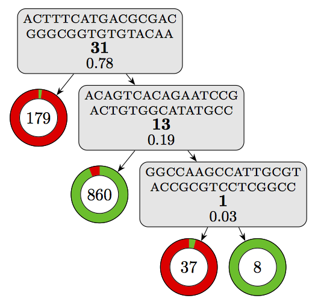
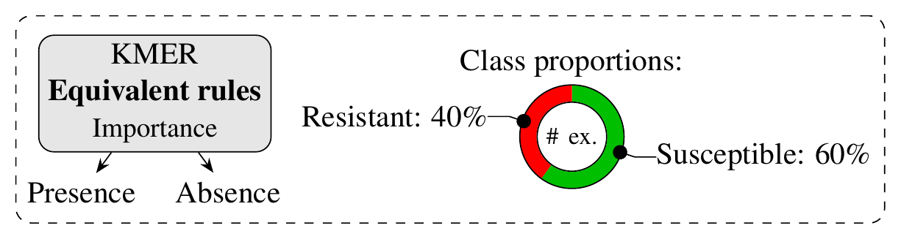

One particularity of models learned with Kover is that they are highly interpretable. The models make predictions based on rules that capture the presence/absence of k-mers. Below, we show how simple it is to go from a learned model to biological interpretation with these models.

 **Disclaimer:** It is always possible to visualize Kover models and access the sequences of k-mers that are used for prediction. However, going further and annotating the sequences is highly dependent on the quality of available genome annotations. Below, we provide an example where well-annotated genomes were available, enabling a detailed interpretation of the model.

In this tutorial, we will show how the decision tree model of kanamycin resistance in *M. tuberculosis* (Figure 3a of the paper) was processed in order to extract a biological interpretation.

### Accessing the model

After each run of `kover learn`, a `model.fasta` file is created in the output directory. This file contains the sequence of each k-mer used by the model, along with an informative header that specifies how the rule participates in the model.

In this tutorial, we will use the following model (see [here](../../models/cart_b/mycobacterium%20tuberculosis/kanamycin/repeat_1/model.fasta)):
```
>rule_id: 0___ex_1084___eq_31, left_child: leaf___ex_179___sensitive_6_0.01704545__resistant_173_0.98295455, right_child: 2___ex_905___eq_13, importance: 0.78
ACTTTCATGACGCGACGGGCGGTGTGTACAA

>rule_id: 2___ex_905___eq_13, left_child: leaf___ex_860___sensitive_833_0.93912063__resistant_27_0.06087937, right_child: 4___ex_45___eq_1, importance: 0.19
ACAGTCACAGAATCCGACTGTGGCATATGCC

>rule_id: 4___ex_45___eq_1, left_child: leaf___ex_37___sensitive_3_0.04225352__resistant_34_0.95774648, right_child: leaf___ex_8___sensitive_8_1.00000000__resistant_0_0.00000000, importance: 0.03
GGCCAAGCCATTGCGTACCGCGTCCTCGGCC
```

Interestingly, this file completely specifies the structure of the model and expert users could use it to integrate the model in external software. However, this goes beyond the scope of this tutorial.

Below, we will see how we can refine this FASTA file to get deeper insight into the model.


### Visualizing the model

Let's start by visualizing the model. For models learned with the Set Covering Machine algorithm, simply open the `report.txt` file in the output directory to visualize the model's logic. There is no need for fancy visualizations in this case, since the structure of the model is very simple (logical-AND or logical-OR).
However, decision tree models can be more complex and thus, it is interesting to plot the model.

You can plot any decision tree model using the `plot_model.py` script (see [here](../../models/plot_model.py)) as follows:
```
python plot_model.py model.fasta
```
 **Warning:** The script assumes that [LaTeX](https://www.latex-project.org/get/) is installed on your computer.

Using this script on our model yields the following visualization:

<a href="./model.pdf"></a>

Where the components can be interpreted as follows:

<a href="../models/legend.pdf"></a>

This already gives a good overview of the decision logic of the model.


### Annotating k-mers

Now, we want to go beyond the k-mer sequences and determine in which regions of the genome they are located. Conveniently, the `model.fasta` files can be directly inputted into tools such as [Nucleotide BLAST](https://blast.ncbi.nlm.nih.gov/Blast.cgi?PAGE_TYPE=BlastSearch).

#### Step 1: Input the model into BLAST

Go the [Nucleotide BLAST](https://blast.ncbi.nlm.nih.gov/Blast.cgi?PAGE_TYPE=BlastSearch) web interface. Then, either copy/paste the content of the FASTA file into the textbox or select the file by clicking on "Choose File".


Press the `BLAST` button at the bottom of the page to launch the query.


#### Step 2: 

Once you have the results, you can use the "Results for" dropdown at the top to select one of the rules in the model. Select the first one and carry on.


#### Step 3: 

Scroll down and look at the hits for the k-mer in the model. We see that not all hits are for *M. tuberculosis*. Also, it looks like we are lucky and the k-mer was found in a GenBank entry specific to a gene. Click on the following hit: `Mycobacterium tuberculosis strain UKR100 16S ribosomal RNA gene, partial sequence`


#### Step 4:

You are then shown more information on the hit. You see the GenBank entry in which it was found and the start and end position in the sequence. Click on the lower GenBank button.


#### Step 5:

You are taken to a [GenBank page](https://www.ncbi.nlm.nih.gov/nucleotide/MG995565.1?report=genbank&log$=nuclalign&blast_rank=8&RID=P9Z2SGYN015&from=1383&to=1413) where more information is available regarding the region in which the k-mer was found:


Scroll down to the bottom of the page:


We see that the k-mer is located in the 16S ribosomal RNA, which is the target of [kanamycin](https://www.drugbank.ca/drugs/DB01172#targets). Hence, we have reason to believe that the algorithm has correctly recovered a confirmed mechanism of antibiotic resistance. Nonetheless, we still don't know what in the 16S rRNA is being detected by the model.


### Analyzing equivalent rules

In this part of the tutorial, we will go further in our interpretation of the first rule of the model. We will use the equivalent rules (see paper) to determine the nature of the genomic variation identified by the learning algorithm. The equivalent rules are given in several files in the output directory that are labelled according to the rule to which they are equivalent. Here, we will use the [model_rule_0_equiv.fasta](../../models/cart_b/mycobacterium%20tuberculosis/kanamycin/repeat_1/model_rule_0_equiv.fasta) file, which contains the sequence of 31 k-mers who's presence was found to be equally predictive of the phenotype.

#### Step 1:

Go back to the GenBank entry where the k-mer was found ([here](https://www.ncbi.nlm.nih.gov/nucleotide/MG995565.1?report=genbank&log$=nuclalign&blast_rank=8&RID=P9Z2SGYN015&from=1383&to=1413)).

In the upper right corner, you will find a form called "Change region shown". Tick the "Whole sequence" box and click on the "Update View" button. This will update the page to shown the entire sequence instead of only the region in which your k-mer was found.


#### Step 2:

Click on the "Send to" button, tick "File" and select the "Genbank (full)" format. Then click on the "Create File" button. This will download the GenBank entry onto your computer.


#### Step 3:

Open the downloaded file using the [Unipro UGENE](http://ugene.net/) software.


#### Step 4:

Click on the "Find pattern" button in the toolbar:


The following menu will appear. Select "Load patterns from file" and select the [model_rule_0_equiv.fasta](../../models/cart_b/mycobacterium%20tuberculosis/kanamycin/repeat_1/model_rule_0_equiv.fasta) file. For the group name, use "Equivalent k-mers" and tick "Use pattern name". Then, click the "Create annotations" button.


#### Step 5:

Look at where the equivalent k-mers are located in the gene's sequence. We see that they all overlap one concise region.


Zoom in and observe that there is only a single base pair at which all the k-mers overlap:


This is base pair 1401 of the gene. Interestingly, other studies have found that the mutation A1401G is associated with kanamycin resistance in M. tuberculosis [[1](https://www.ncbi.nlm.nih.gov/pubmed/15700953), [2](https://www.ncbi.nlm.nih.gov/pubmed/9574680), [3](http://journals.plos.org/plosone/article?id=10.1371/journal.pone.0033275)]. Given that we observe a guanine at this locus and that it is the presence of the k-mers that leads to a "resistance" prediction in the model, we can conclude that the model correctly detects the presence of this mutation.

Success! We have been able to 1) detect the gene targetted by a rule in the model, 2) pinpoint the exact location of a confirmed resistance mechanism. 

Now go try this on your data and see if you can elucidate the biological mechanisms that underlie your favorite phenotype.