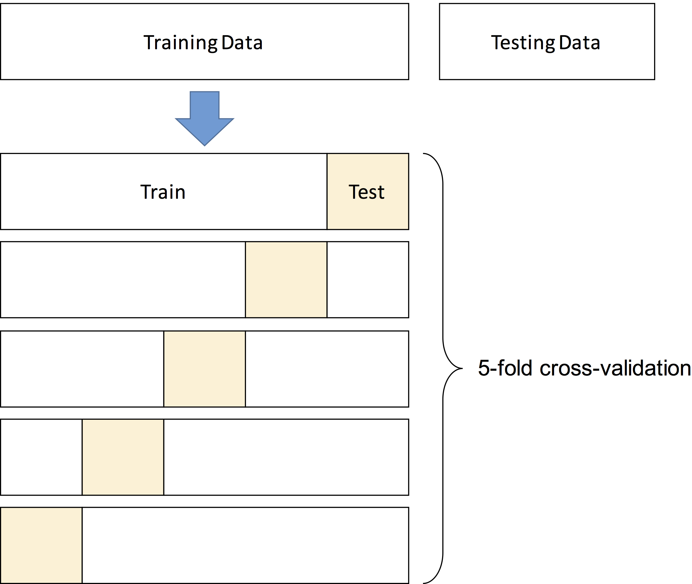

## Set Covering Machine

The Set Covering Machine (SCM) algorithm produces models that are conjunctions (logical-AND) or disjunctions (logical-OR) of rules. It can be used for binary phenotypes, i.e., two groups of individuals.


### Command line interface

This command is used to train the SCM on a Kover dataset:

```
usage: kover learn scm [-h] --dataset DATASET --split SPLIT
                       [--model-type {conjunction,disjunction} [{conjunction,disjunction} ...]]
                       [--p P [P ...]] [--kmer-blacklist KMER_BLACKLIST]
                       [--max-rules MAX_RULES]
                       [--max-equiv-rules MAX_EQUIV_RULES]
                       [--hp-choice {bound,cv,none}]
                       [--bound-max-genome-size BOUND_MAX_GENOME_SIZE]
                       [--random-seed RANDOM_SEED] [--n-cpu N_CPU]
                       [--output-dir OUTPUT_DIR] [-x] [-v]

Learn a conjunction/disjunction model using the Set Covering Machine
algorithm.

optional arguments:
  -h, --help            show this help message and exit
  --dataset DATASET     The Kover dataset to use for learning.
  --split SPLIT         The identifier of the split of the dataset to use for
                        learning.
  --model-type {conjunction,disjunction} [{conjunction,disjunction} ...]
                        Hyperparameter: The type of model to learn,
                        conjunction (logical-AND) or disjunction (logical-OR).
                        You can specify multiple space separated values. Refer
                        to the documentation for more information.
  --p P [P ...]         Hyperparameter: The value of the trade-off parameter
                        in the rule scoring criterion. You can specify
                        multiple space separated values. Refer to the
                        documentation for more information.
  --kmer-blacklist KMER_BLACKLIST
                        A file containing a list of k-mers to remove from the
                        analysis.These k-mers guaranteed not to be used in the
                        models.File format: fasta file or text file with one
                        k-mer per line.
  --max-rules MAX_RULES
                        The maximum number of rules that can be included in
                        the model.
  --max-equiv-rules MAX_EQUIV_RULES
                        The maximum number of equivalent rules to report for
                        each rule in the model. This only affects model
                        interpretation. Use the default unless you expect that
                        the rules in the model will be equivalent to more than
                        10000 other rules.
  --hp-choice {bound,cv,none}
                        The strategy used to select the best values for
                        hyperparameters. The default is k-fold cross-
                        validation, where k is the number of folds defined in
                        the split. Other strategies, such as bound selection
                        are available (refer to the documentation). Using none
                        selects the first value specified for each
                        hyperparameter.
  --bound-max-genome-size BOUND_MAX_GENOME_SIZE
                        Specify this only if --hp-choice is bound. The maximum
                        size, in base pairs, of any genome in the dataset. If
                        you are unsure about this value, you should use an
                        overestimation. This will only affect the tightness of
                        the bound on the error rate. By default number of
                        k-mers in the dataset is used.
  --random-seed RANDOM_SEED
                        The random seed used for any random operation. Set
                        this if only if you require that the same random
                        choices are made between repeats.
  --n-cpu N_CPU, --n-cores N_CPU
                        The number of CPUs used to select the hyperparameter
                        values. Make sure your computer has enough RAM to
                        handle multiple simultaneous trainings of the
                        algorithm and that your storage device will not be a
                        bottleneck (simultaneous reading).
  --output-dir OUTPUT_DIR
                        The directory in which to store Kover's output. It
                        will be created if it does not exist.
  -x, --progress        Shows a progress bar for the execution.
  -v, --verbose         Sets the verbosity level.
```

### Understanding the hyperparameters

A [hyperparameter](https://en.wikipedia.org/wiki/Hyperparameter_(machine_learning)) is a parameter of the learning algorithm that controls its behavior and that must be set by the user prior to learning.
Generally, the user defines a set of candidate values for each hyperparameter and uses a strategy, such as
[cross-validation](https://en.wikipedia.org/wiki/Cross-validation_(statistics)), to select the best value (see [below](#hyperparameter-selection-strategies)).

SCM has 2 hyperparameters:

* The model type (option --model-type)
* The trade-off parameter (option --p)

*Note: Below, the term example refers to a (genome, phenotype) pair in the dataset.

#### The model type

SCM can learn models that are conjunctions (logical-AND) or disjunctions (logical-OR)of rules (presence or absence of k-mers). The optimal model type
depends on the phenotype and, in absence of prior knowledge, both types should be tried.

This is achieved by using:
```
--model-type conjunction disjunction
```

#### The trade-off parameter (p)

SCM selects the rules to include in the model based on a scoring function that is applied to each rule. This function
consists of a trade-off between the number of errors incurred on each class of examples (e.g., case and control).

For example, when learning a conjunction, the score of each rule is given by:

$$ S_i = N_i - p \times \overline{P_i}$$

where:

* $S_i$ is the score of rule i
* $N_i$ is the number of negative (e.g., control) examples that are correctly classified by the rule
* $\overline{P_i}$ is the number of positive (e.g., case) examples that are incorrectly classified by the rule

Hence, larger values of p increase the importance of errors made on negative examples, while smaller values will increase
the importance of errors made on the positive examples.

Again, the optimal value is problem specific and many values must be tried. For example, we often use:

```
--p 0.1 0.178 0.316 0.562 1.0 1.778 3.162 5.623 10.0 999999.0
```


## Classification trees

The Classification and Regression Trees (CART) algorithm learns decision tree models. The classification trees part of this algorithm is implemented in Kover. It can be used for any discrete phenotype (i.e, it supports more than two groups of individuals). Its models are generally more complex than those of SCM, but can sometimes be more accurate. Of note, our tree implementation uses [minimum cost-complexity pruning](http://mlwiki.org/index.php/Cost-Complexity_Pruning) to reduce the complexity of its models.


### Command line interface

This command is used to train CART on a Kover dataset:

```
usage: kover learn tree [-h] --dataset DATASET --split SPLIT
                        [--criterion {gini,crossentropy} [{gini,crossentropy} ...]]
                        [--max-depth MAX_DEPTH [MAX_DEPTH ...]]
                        [--min-samples-split MIN_SAMPLES_SPLIT [MIN_SAMPLES_SPLIT ...]]
                        [--class-importance CLASS_IMPORTANCE [CLASS_IMPORTANCE ...]]
                        [--kmer-blacklist KMER_BLACKLIST]
                        [--hp-choice {bound,cv}]
                        [--bound-max-genome-size BOUND_MAX_GENOME_SIZE]
                        [--n-cpu N_CPU] [--output-dir OUTPUT_DIR] [-x] [-v]

Learn a decision tree model using the Classification And Regression Trees
algorithm.

optional arguments:
  -h, --help            show this help message and exit
  --dataset DATASET     The Kover dataset to use for learning.
  --split SPLIT         The identifier of the split of the dataset to use for
                        learning.
  --criterion {gini,crossentropy} [{gini,crossentropy} ...]
                        Hyperparameter: The criterion used to partition the
                        leaves of the decision tree. You can specify multiple
                        space separated values. Refer to the documentation for
                        more information. (default: gini)
  --max-depth MAX_DEPTH [MAX_DEPTH ...]
                        Hyperparameter: The maximum depth of the decision
                        tree. You can specify multiple space separated values.
                        Refer to the documentation for more information.
                        (default: 10)
  --min-samples-split MIN_SAMPLES_SPLIT [MIN_SAMPLES_SPLIT ...]
                        Hyperparameter: The minimum number of genomes that a
                        leaf must contain to be partionned into two new
                        leaves. You can specify multiple space separated
                        values. Refer to the documentation for more
                        information. (default: 2)
  --class-importance CLASS_IMPORTANCE [CLASS_IMPORTANCE ...]
                        Hyperparameter (this one is tricky so read carefully):
                        This controls the cost of making prediction errors on
                        each class. You can either specify a set of space-
                        separated values, which will result in trying each
                        value for each class, or provide a set of class-
                        specific values to try using the following syntax:
                        "class1: v1 v2 class2: v1 v2 v3 ...". Refer to the
                        documentation for more information. (default: 1.0 for
                        each class)
  --kmer-blacklist KMER_BLACKLIST
                        A file containing a list of k-mers to remove from the
                        analysis.These k-mers guaranteed not to be used in the
                        models.File format: fasta file or text file with one
                        k-mer per line.
  --hp-choice {bound,cv}
                        The strategy used to select the best values for the
                        hyperparameters. The default is k-fold cross-
                        validation, where k is the number of folds defined in
                        the split. Alternatively, you can use bound selection,
                        which is much faster, but may not work as well for
                        smaller datasets. Also note that, even if a single
                        value is provided for each hyperparameter, a search
                        will be performed as part of the tree pruning process.
                        Refer to the documentation for more information.
                        (default: cv)
  --bound-max-genome-size BOUND_MAX_GENOME_SIZE
                        Specify this only if --hp-choice is bound. The maximum
                        size, in base pairs, of any genome in the dataset. If
                        you are unsure about this value, you should use an
                        overestimation. This will only affect the tightness of
                        the bound on the error rate. By default number of
                        k-mers in the dataset is used.
  --n-cpu N_CPU, --n-cores N_CPU
                        The number of CPUs used to select the hyperparameter
                        values. Make sure your computer has enough RAM to
                        handle multiple simultaneous trainings of the
                        algorithm and that your storage device will not be a
                        bottleneck (simultaneous reading).
  --output-dir OUTPUT_DIR
                        The directory in which to store Kover's output. It
                        will be created if it does not exist.
  -x, --progress        Shows a progress bar for the execution.
  -v, --verbose         Sets the verbosity level.
```

### Understanding the hyperparameters

*If you don't know what a hyperparameter is, see [here](#understanding-the-hyperparameters)*

The hyperparameters of the CART algorithm are:
* The rule-selection criterion (option --criterion)
* The maximum depth of the tree (option --max-depth)
* The minimum number of examples required to partition a leaf (option --min-samples-split)
* The class importances (option --class-importance)

#### Rule-selection criterion

Decision tree are grown by recursively partitionning leaves using rules based on the presence/absence of k-mers. These rules are chosen according to a predefined criterion.
A typical choice is the *gini impurity* (default value) that favors rules that lead to pure leaves (i.e., that contain a single class). Kover implements two criteria: the gini impurity and the cross-entropy. We often use the latter:

```
--criterion gini
```

#### Maximum depth of the tree

The decision tree will be grown until the maximum depth is reached or there are no more leaves that can be partitionned. Subsequently, it will be pruned, using minimum cost-complexity pruning, before being outputted by Kover. Since we use pruning, there is no need to try a list of values for this parameter. We often set it to 20 (or less depending on the available compute time):

```
--max-depth 20
```

#### Minimum number of examples required to partition a leaf

This parameter limits the complexity of the resulting model by requiring that leaves contain at least a certain amount of examples to be partitionned. Since we use pruning, there is no need in doing extensive search for good values of this parameter. We typically set it to 2 (or less if we want the results faster):

```
--min-samples-split 2
```

#### Class importances

This reweights the importance of the classes in the learning process. Hence, if a class is less abundant than the other, it may be useful to upweight it, so that it is considered equally when building the model. We typically try a range of values for this parameter:

```
--class-importance 0.25 0.5 0.75 1.0
```


## Hyperparameter selection strategies

The are many strategies to select the values of hyperparameters. Kover implements two of them, which are described below:

* k-fold cross-validation: good for smaller datasets, computationally intensive
* Risk bound selection: good for larger datasets, k+1 times faster than k-fold CV

#### k-fold cross-validation

This is the most widely used method in machine learning. The data is partitioned into a training and a testing set.
The training set is then used to determine the best hyperparameter values and to learn the final model. The testing set
is set aside and subsequently used to evaluate the accuracy of the final model.

In k-fold cross-validation, the training data is partitioned into k blocks of equal size (called folds). Then, for each
possible combination of values for the hyperparameters, the following procedure is applied. One at a time, the folds are
set aside for testing and the remaining (k-1) folds are used to train the algorithm. The score of a combination of values
is measured as the average number of correct predictions on the left out folds.

Below is an illustration of 5-fold cross-validation:




The combination of hyperparameter values with the greatest score is then selected and used to retrain
the learning algorithm from the entire training set, yielding the final model.

To use this strategy in Kover, you must:

- Define the number of folds when using the [kover dataset split](doc_dataset.html#splitting-a-dataset) command.
- Use ```--hp-choice cv``` in the [kover learn](#learning-models) command

<br/>
**Choosing the number of folds**

The general standard is 5 or 10 fold cross-validation. For smaller datasets, the number of folds can be increased,
which results in more data available for training the algorithm and thus, a better estimate of the score of the
hyperparameter values.


**Note**

The major disadvantage of this method is that it requires training the algorithm k+1 times for each combination of hyperparameter
values. This can be computationally intensive for larger datasets. If you encounter long running times with this method,
we recommend trying risk bound selection, which is described below.


#### Risk bound selection

Risk bound selection is a great alternative to cross-validation for larger datasets. It is much faster and requires a
single training of the learning algorithm to score each combination of hyperparameter values. This method consists of
training the algorithm on the entire training set using each hyperparameter combination and using a mathematical expression
to estimate the maximum risk (error rate) of the obtained model on unseen data. The combination of hyperparameter values
that yields the smallest bound value is retained.

To use this strategy in Kover, you must use the following parameters for the [kover learn](#learning-models) command:

- ```--hp-choice bound```
- ```--bound-max-genome-size x```, where x is any number that is greater or equal than the number of base pairs in the largest genome of
the dataset. This will only affect the tightness of the bound on the error rate. By default the number of k-mers in the dataset is used,
but using a better estimate will help selecting better hyperparameters.

**Note**

While this method is fast, the bound value can be inaccurate if there are too few learning examples. The minimum number
of examples varies between phenotypes.