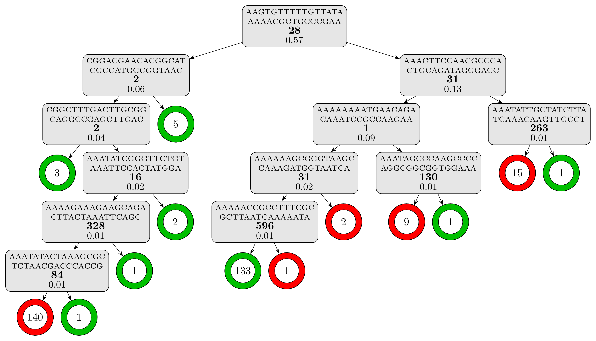
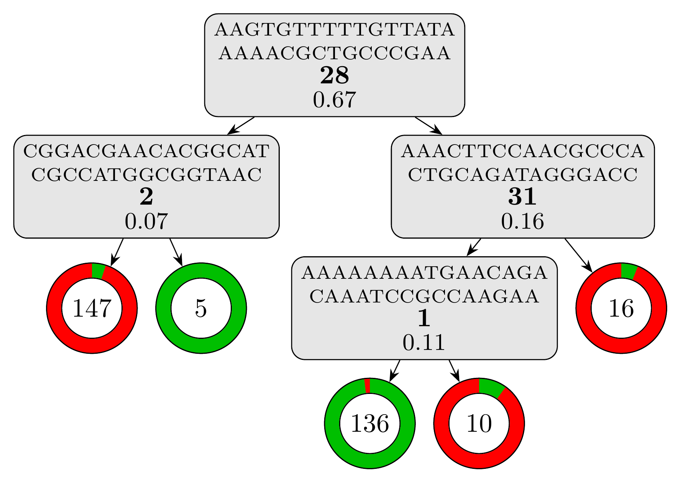

This tutorial will walk you through an application of Kover to a set of genomes labelled according to their phenotypes. We use data from the paper (see [data](https://github.com/aldro61/kover2_paper/tree/master/data)), but you could use your own. Specifically, we will use the CART and SCM algorithms to learn models that predict Azithromycin resistance in *Neisseria gonorrhoeae*.

For an introduction to machine learning , please refer to [this tutorial](https://aldro61.github.io/microbiome-summer-school-2017/sections/basics/).


## Getting the example Kover dataset

First download the [pre-created dataset](https://graal.ift.ulaval.ca/public/kover2_example_created.zip) (~100 Mb) which contains the genome of 392 *Neisseria gonorrhoeae* isolates, along with their susceptibility to Azithromycin. Next, unzip the file and then change into the resulting directory.

```
cd kover-example
```

The file "example.kover" is the Kover dataset which use a compressed and optimized representation of the data ([details here](https://github.com/aldro61/kover/wiki/Kover-Dataset-Format)).

### Exploring the dataset

You can use the [kover dataset info](https://aldro61.github.io/kover/doc_dataset.html#listing-information-about-a-dataset) command to print information about the dataset. For example, to print the number of genomes and k-mers in the dataset, use:

```
kover dataset info --dataset example.kover --genome-count --kmer-count
```

Your dataset contains **392 genomes vs. 4 766 702 k-mers**! Notice that the number of genomes is significantly smaller than the number of k-mers. In machine learning, this is known as *fat data* and is particularly challenging for learning algorithms. Fortunately, Kover is very efficient at learning from this kind of data.

## Splitting the data into training and testing sets

In order to measure the accuracy of models obtained using Kover, we must split the data into a training set and a 
validation set. The training set will be used to learn models and the validation set will be used to measure their accuracy.
A Kover dataset can contain multiple splits of the data, which are created using the [kover dataset split](https://aldro61.github.io/kover/doc_dataset.html#splitting-a-dataset) command.

Furthermore, the algorithms implemented in Kover have [hyperparameters](https://aldro61.github.io/kover/doc_learning.html#understanding-the-hyperparameters), which are parameters that control the behavior of the algorithm and must be manually set by the user.
Selecting the value of such parameters is known as [model selection](https://en.wikipedia.org/wiki/Hyperparameter_optimization).
Kover implements two model selection strategies: [k-fold cross-validation](https://aldro61.github.io/kover/doc_learning.html#k-fold-cross-validation) and [bound selection](https://aldro61.github.io/kover/doc_learning.html#risk-bound-selection).
k-fold cross-validation is the most expensive and it requires that small partitions of the data, called *folds* be created.
Bound selection is considerably faster and does not require the creation of such folds.

The following command creates a split of the data called "example_split", which uses 80% of the genomes for training and
20% for testing. It also creates 10 cross-validation folds. The data are partitioned randomly, using 2 as the random seed.

```
kover dataset split --dataset example.kover --id example_split --train-size 0.80 --folds 10 --random-seed 2 --progress
```

 **Note:** You can set ``--folds 0`` if you will only be using bound selection.


## Learning models

Now that we have created and splitted the dataset, we are ready to learn predictive model of Azithromcycin resistance in *Neisseria gonorrhoeae*. The [kover learn](doc_learning.html#learning-models) command is used to learn models for Set Covering Machines and Classficication and Regression Trees.

### Set Covering Machines

Let start by training the Set Covering Machine algorithm on this dataset. We will try the following values for the hyperparameters:
* Maximum number of rules in the model: 10
* Type of model: conjunction (logical-AND) or disjunction (logical-OR)
* p (see [documentation](https://aldro61.github.io/kover/doc_learning.html#understanding-the-hyperparameters)):  0.1, 1.0 and 10.0


#### Cross-Validation

The following command tells Kover to use the SCM algorithm and cross-validation as the [model selection strategy](doc_learning.html#hyperparameter-selection-strategies).
Moreover, it distributes the cross-validation on 4 CPUs and outputs the result files into the *results/scm_cv* directory.

```
kover learn scm --dataset example.kover --split example_split --model-type conjunction disjunction --p 0.1 1.0 10.0 --max-rules 10 --hp-choice cv --n-cpu 4 --output-dir results/scm_cv --progress
```

The total computation time is around **3 minutes**. Kover then uses the obtained model to predict the phenotype of the genomes in the testing set and computes various metrics.
For this example, the obtained model is:

```
Model (Conjunction - 3 rules):
------------------------------
Presence(AAACTTCCAACGCCCACTGCAGATAGGGACC) [Importance: 0.74, 62 equivalent rules]
AND
Absence(AGAGTCGTTGTCTTTGGGCCATTCGCCGTGA) [Importance: 0.17, 2 equivalent rules]
AND
Presence(ATTCGACTGTGCGTAAAAATCGTCCGCTACG) [Importance: 0.18, 7 equivalent rules]
```

Notice the simplicity and interpretability of the obtained model. 
The testing set metrics for this model are:

```
Error Rate: 0.08974
Sensitivity: 1.0
Specificity: 0.85106
Precision: 0.81579
Recall: 1.0
F1 Score: 0.89855
True Positives: 31.0
True Negatives: 40.0
False Positives: 7.0
False Negatives: 0.0
```

#### Bound selection

Let's now use bound selection as the [model selection strategy](doc_learning.html#hyperparameter-selection-strategies) and compare it to cross-validation. We only have to modify the previous command to specify `--hp-choice bound` and output the result files in another directory, *results/scm_b*.

```
kover learn scm --dataset example.kover --split example_split --model-type conjunction disjunction --p 0.1 1.0 10.0 --max-rules 10 --hp-choice bound  --output-dir results/scm_b --progress
```

Using bound selection, the computation time drop to just under **20 seconds**! The resulting model has the same number of rules, but relies on different k-mers.

```
Model (Conjunction - 3 rules):
------------------------------
Absence(AAGTGTTTTTGTTATAAAAACGCTGCCCGAA) [Importance: 0.85, 28 equivalent rules]
AND
Presence(AAACTTCCAACGCCCACTGCAGATAGGGACC) [Importance: 0.60, 62 equivalent rules]
AND
Absence(ACACGGGGATGAGTTTGAACAGGTCGGTTAC) [Importance: 0.19, 19 equivalent rules]
```

And the testing set metrics for this new model are:
```
Error Rate: 0.02564
Sensitivity: 1.0
Specificity: 0.95745
Precision: 0.93939
Recall: 1.0
F1 Score: 0.96875
True Positives: 31.0
True Negatives: 45.0
False Positives: 2.0
False Negatives: 0.0
```

As we can see, for this example, using bound selection instead of cross-validation requires less computation time and produces a more accurate model.

### Classification and Regression Trees

Let's now learn a decision tree model using the Classification and Regression Tree algorithm. We will try the following values for the hyperparameters:
* Max depth: 20
* Minimum number of examples to split a leaf: 2
* Criterion: gini

#### Cross-Validation

The following command tells Kover to learn a tree model, using cross-validation as the [model selection strategy](doc_learning.html#hyperparameter-selection-strategies).
Moreover, it distributes the cross-validation on 4 CPUs and outputs the result files into the *results/cart_cv* directory.

```
kover learn tree --dataset example.kover --split example_split --criterion gini --max-depth 20 --min-samples-split 2 --hp-choice cv --n-cpu 4 --output-dir results/cart_cv --progress
```

The computation time is slightly under **5 minutes** and the resulting tree model, which contains 12 rules and has a depth of 6, is textually represented in the report (*results/cart_cv/report.txt*). For a better visual representation, we can use the [plot_model.py](../models/plot_model.py) script, which should be present alongside the data:

 **Warning:** The script assumes that [LaTeX](https://www.latex-project.org/get/) is installed on your computer.

```
python plot_model.py results/cart_cv/model.fasta
```
to obtain the following representation of the decision tree model:

<a></a>

The testing set metrics for this model are:

```
Error Rate: 0.03846
Sensitivity: 1.0
Specificity: 0.93617
Precision: 0.91176
Recall: 1.0
F1 Score: 0.95385
True Positives: 31.0
True Negatives: 44.0
False Positives: 3.0
False Negatives: 0.0
```
#### Bound selection

Let's now use bound selection as the [model selection strategy](doc_learning.html#hyperparameter-selection-strategies) and see how it affect the learning for CART. We only have to modify the previous command to specify `--hp-choice bound` and output the result files in another directory, *results/cart_b*.

```
kover learn tree --dataset example.kover --split example_split --criterion gini --max-depth 20 --min-samples-split 2 --hp-choice bound --n-cpu 4 --output-dir results/cart_b --progress
```

Using bound selection, the computation time drop to just under **25 seconds**! The resulting model is a lot simpler with only 4 rules and a depth of 3. Using the same script, we can visualize the model:

```
python plot_model.py results/cart_b/model.fasta
```
we obtain this visual representation highlighting how simple and interpretable this model is:

<a></a>

And the testing set metrics for this new model are:

```
Error Rate: 0.01282
Sensitivity: 1.0
Specificity: 0.97872
Precision: 0.96875
Recall: 1.0
F1 Score: 0.98413
True Positives: 31.0
True Negatives: 46.0
False Positives: 1.0
False Negatives: 0.0
```

That's it! You know how to use Kover to learn rule-based genotype-to-phenotype models. Now, try it on your own data.

For a tutorial on interpreting the learned models using genome annotations, see [here](./doc_tut_interp.md).
